# find_il2cpp_api2.js使用方法
使用该脚本前需要对脚本中find_il2cpp_api函数用到的偏移进行修改
对应的7个偏移的位置可参考以下方法寻找

il2cpp_class_get_methods对应的偏移可在ida解析完libil2cpp.so之后直接搜索字符串
"InternalArray__"通过其交叉引用定位到需要的函数附近
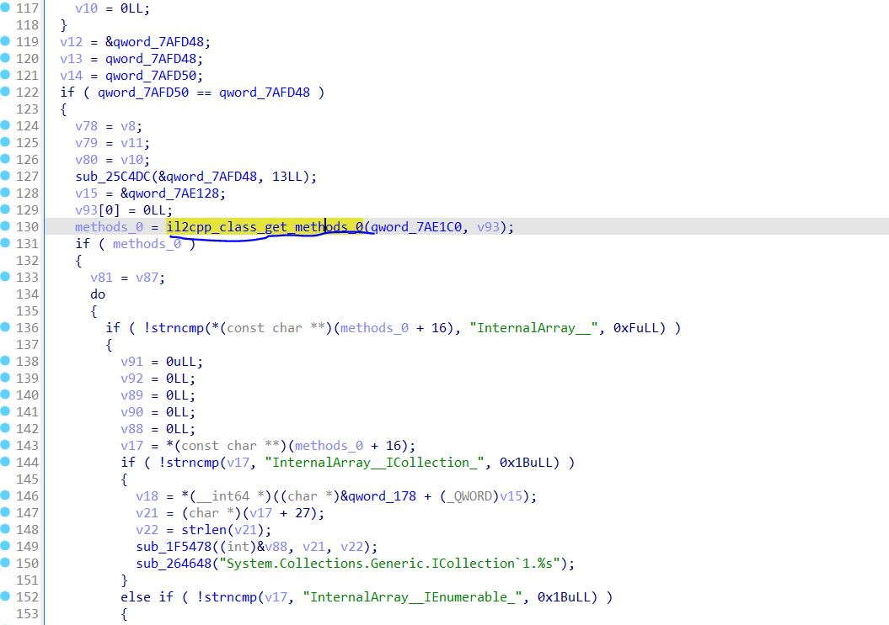
图上标识的函数的地址即是需要的偏移
或者搜索字符串"ConstructorInfo"，该字符串只在较低版本的unity版本中存在
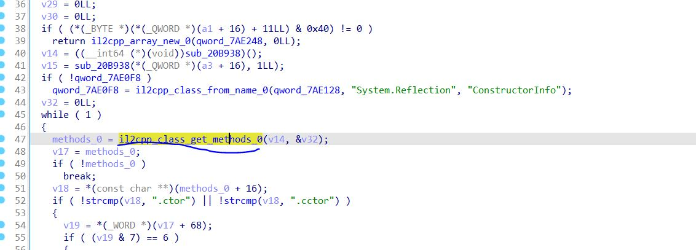

il2cpp_method_get_name，il2cpp_class_get_name，il2cpp_class_get_namespace，
il2cpp_class_get_type，il2cpp_method_get_param，il2cpp_method_get_param_count的偏移查找方式都是相似的。

以查找il2cpp_method_get_name需要的偏移为例
在ida解析完libunity.so之后搜索字符串"Script error (%s): %s.\n"通过其交叉引用定位到需要的函数附近
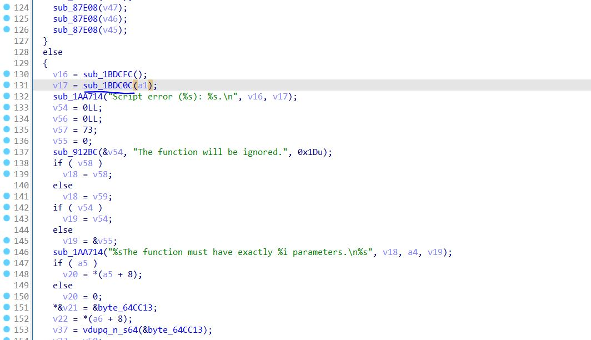
找到上图标识的函数，该函数实际上是个充当间接跳转的函数，其伪代码形式如下
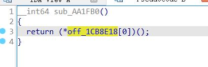
在ida中直接点击上图变量即可看到它指向另一个变量，该被指向的变量的地址即为需要的偏移
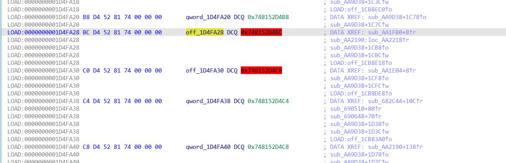

其余五个偏移的查找都是类似的，只是查找充当间接跳转的函数的方法不一样。

il2cpp_class_get_name对应的间接跳转函数需要搜索字符串"%s%s%s must be instantiated using the ScriptableObject.CreateInstance method instead of new %s."再通过交叉引用定位到函数调用附近处
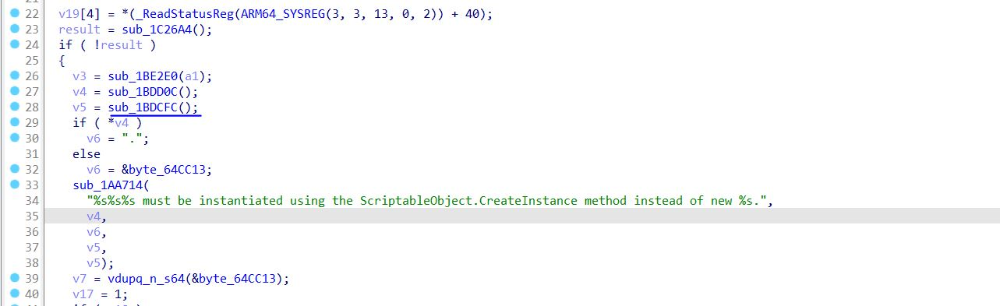

il2cpp_class_get_namespace对应的间接跳转函数需要搜索字符串"%s%s%s must be instantiated using the ScriptableObject.CreateInstance method instead of new %s."再通过交叉引用定位到函数调用附近处
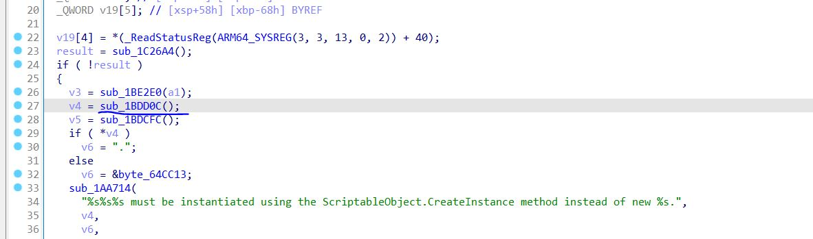

il2cpp_class_from_type对应的间接跳转函数需要搜索字符串"Unsupported enum type '%s' used for field '%s' in class '%s'"再通过交叉引用定位到函数调用附近处
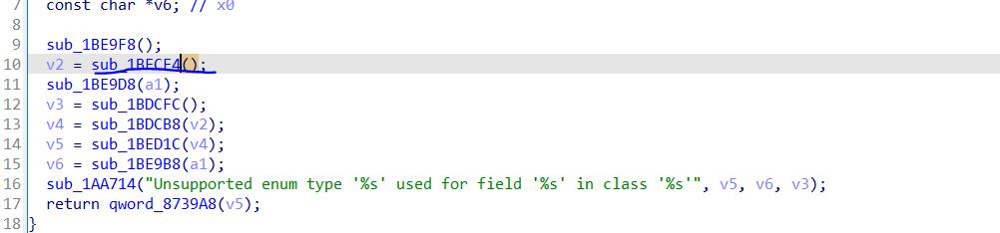

il2cpp_class_get_type对应的间接跳转函数需要搜索字符串"Unsupported enum type '%s' used for field '%s' in class '%s'"再通过交叉引用定位到函数调用附近处
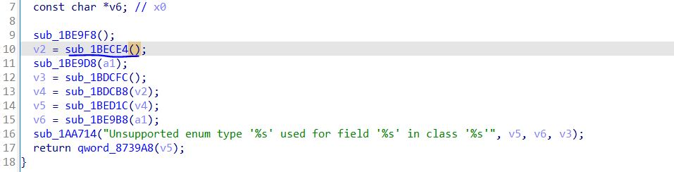

il2cpp_method_get_param对应的间接跳转函数需要搜索字符串"Script error(%s): %s.\n"再通过交叉引用定位到函数调用附近处
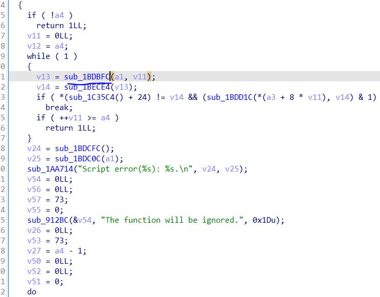

il2cpp_method_get_param_count对应的间接跳转函数需要搜索字符串"Failed to call function %s of class %s\n"再通过交叉引用定位到函数调用附近处
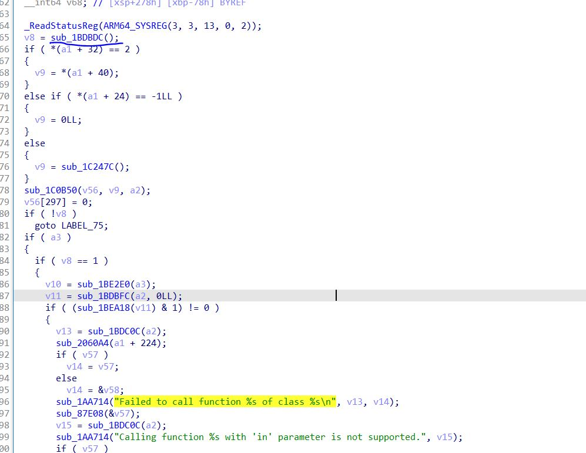

在正确找到并修改上述所需的7个偏移后，待游戏完成加载后注入该脚本，并主动调用find_il2cpp_api函数即可打印出所需的il2cpp_api

# find_il2cpp_api.js使用方法
使用frida spawn启动app注入该脚本，待游戏完成加载后主动调用print函数即可打印il2cpp的api的相应偏移。
 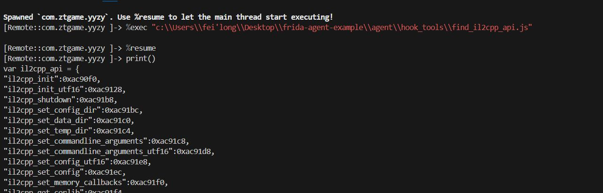

 之后可以配合frida-il2cpp-bridge这个项目使用，修改frida-il2cpp-bridge\node_modules\frida-il2cpp-bridge\dist下的index.js文件处的函数r进行如下图所示的修改
 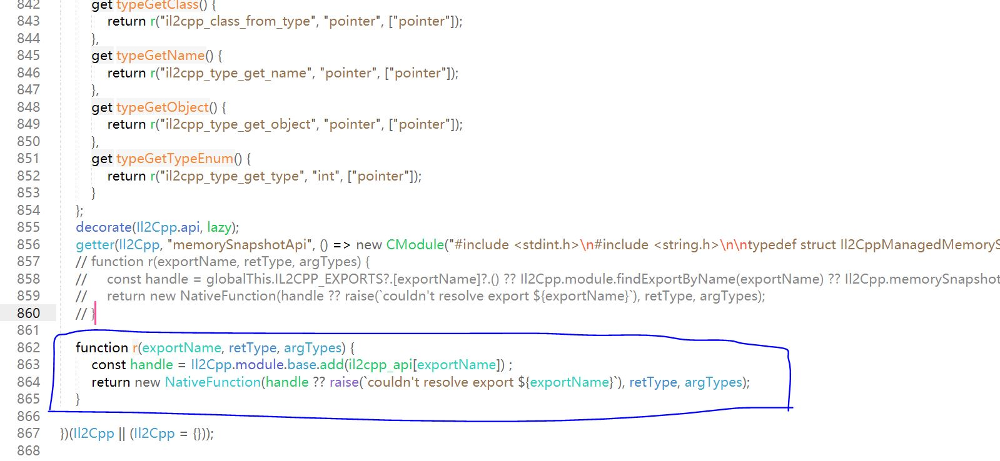

 再将本脚本打印出来的内容粘贴至该文件末端处
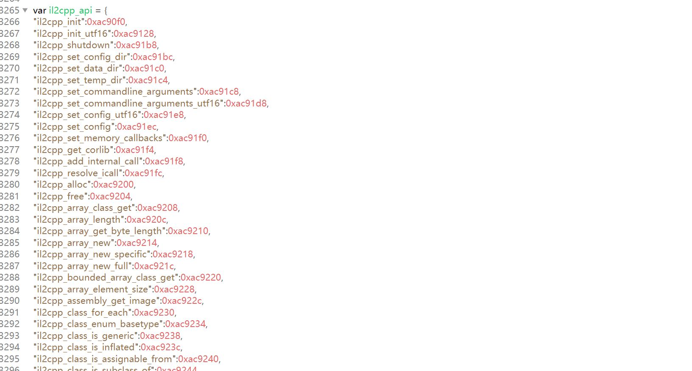
即可增强frida-il2cpp-bridge对抗il2cpp api混淆或隐藏的能力。
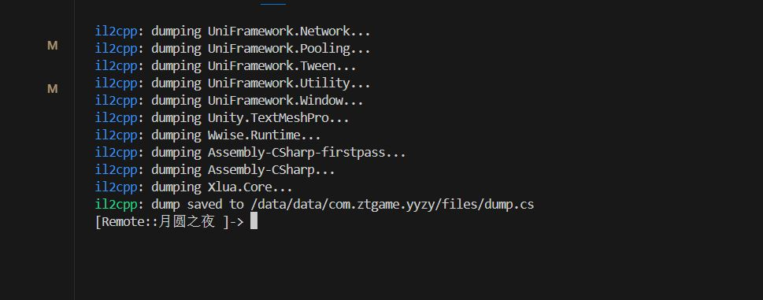

 # 注意事项
 该项目为frida脚本，如果游戏有相应检测，需要过掉检测才能正常运行，且该项目只能无视简单的il2cpp api的混淆或隐藏。

