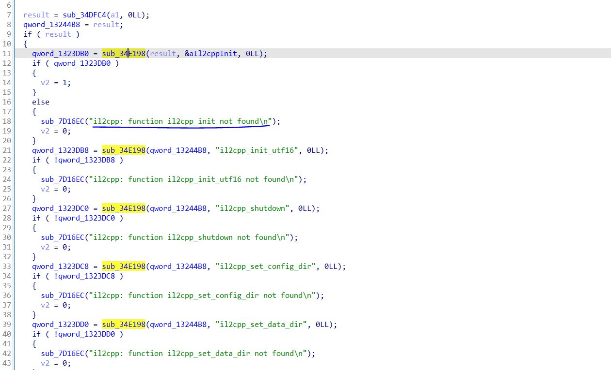

# 使用方法
 先确定find_il2cpp_api.js中get_il2cpp_api函数LookupSymbol_addr变量需要的偏移量，可用ida解析相应游戏的libunity.so，再搜索字符串il2cpp: function il2cpp_init not found可定位到引用LookupSymbol函数的附近处
 
 如上图所示，特征字符串上面被多次引用的函数即是需要的函数，这里示例为0x34E198，不同游戏这个值是不相同的。

 在修改了这个偏移后即可spawn启动app注入该脚本，待游戏完成加载后主动调用print函数即可打印il2cpp的api的相应偏移。
 

 之后可以配合frida-il2cpp-bridge这个项目使用，修改frida-il2cpp-bridge\node_modules\frida-il2cpp-bridge\dist下的index.js文件处的函数r进行如下图所示的修改
 

 再将本脚本打印出来的内容粘贴至该文件末端处

即可增强frida-il2cpp-bridge对抗il2cpp api混淆或隐藏的能力。

 # 注意事项
 该项目为frida脚本且注入时机较早，如果游戏有相应检测，需要过掉检测才能正常运行，且该项目只能无视简单的il2cpp api的混淆或隐藏。

